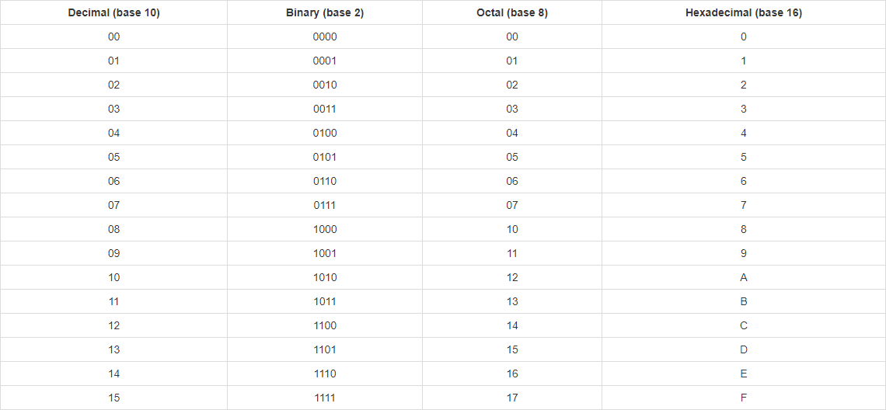

[Base Converter](http://rgbstudios.org/base-convert) &mdash; RGB Studios

**A simple number base converter with a reference chart**

http://rgbstudios.org/base-convert

### Features

Convert between binary(2), octal(8), decimal(10) and hex(16).

View, download, or print our quick reference chart:

If applicable, the corresponding row in the chart will be highlighted.

Click "Arithmetic" for operations such as addition, subtraction, multiplication, and division, and even enter your inputs in two different bases and convert to a third.

View your conversion history, download it, or clear it.

Click the fullscreen button to go fullscreen, great for a classroom setting.

### Keyboard Shortcuts

Hit <kbd>Enter</kbd> (or <kbd>Tab</kbd>) to calculate other values

Use <kbd>Tab</kbd> and <kbd>Shift</kbd>+<kbd>Tab</kbd> to navigate inputs

Use the <kbd>&uarr;</i></kbd> <kbd>&darr;</i></kbd> arrow keys to increment or decrement your input

### About

Calculator and gear images from https://undraw.co

Contact: [contact@rgbstudios.org](mailto:contact@rgbstudios.org)

Version 1.1.0

by [Justin Golden](https://justingolden21.github.io) for [RGB Studios](https://rgbstudios.org)
